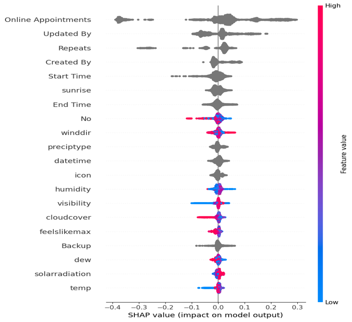
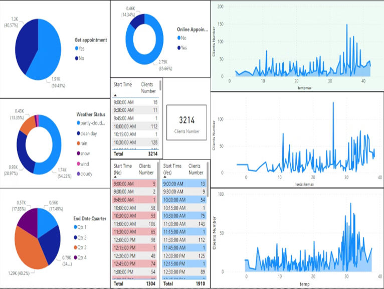
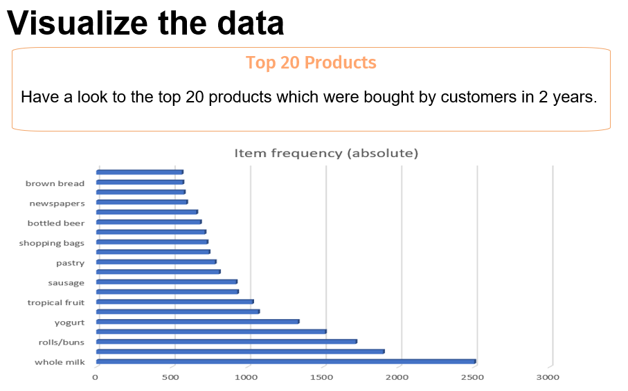
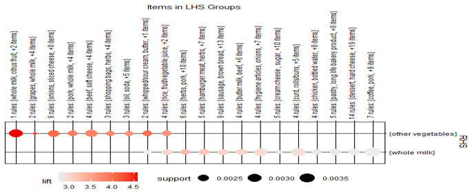

## About
I’m a business analyst and consultant with a passion for helping companies grow through a mix of strategic planning and data-driven insight. My experience spans startup strategy, market research, customer journey design, and sales optimization. I’ve worked with early-stage companies to design go-to-market plans, build clear value propositions, and identify untapped market opportunities. On the analytical side, I create predictive models, build dashboards, and extract insights from complex datasets to guide decision-making. I enjoy the challenge of connecting market realities with business strategy — turning data into clear actions that deliver results. My background in data analytics (trained in Paris) combined with hands-on work in business development allows me to bridge strategy and execution seamlessly.

## Expertise
- **Business Strategy** – Go-to-market planning, competitive analysis, business model design.

- **Data Analytics** – Power BI, Tableau, Python, SQL, predictive modeling.

- **Startup Growth** – Revenue optimization, ROI calculation, market segmentation.

- **Project Delivery** – Agile frameworks, strategic roadmapping, stakeholder engagement.

## Tools I Use
Power BI · Tableau · Python · SQL · Machine Learning (Logistic Regression, Random Forest) · Market Research Frameworks · Business Model Canvas

## Selected Experience
**Spark Bridge – Startup Business Consultant & Data Analyst (Remote, Canada)**

- Designed full business plans, pitch decks, and market entry strategies for startups.

- Analyzed competitors, defined target personas, and identified growth opportunities.

- Created revenue models and calculated ROI for early-stage businesses.

- Used customer journey mapping to guide acquisition and retention strategies.

**Pars Radin – Business Analyst (Tehran)**

- Built predictive models to forecast customer behavior and improve conversion rates.

- Integrated weather data with marketing analysis to uncover purchase patterns.

- Created Power BI dashboards to track sales performance and market trends.

**Rio Coffee – Strategic Planning Specialist (Tehran)**

- Researched market trends and customer behavior to inform operational strategies.

- Designed marketing initiatives to increase brand engagement and sales.

## Professional Projects
**Startup Business Planning & Market Analysis – Spark Bridge**

- For one of the projects I worked on – GoalMate24 – I was deeply involved from the early brainstorming sessions, contributing over 85% of the core ideas. These included behavioral insights to better understand client needs and help them find more suitable matches. I translated these ideas into a complete business plan, designed a clear go-to-market strategy with risk mitigation, and created the pitch deck and playbook to guide execution. This is just one example of the strategic and creative input I’ve brought to multiple startup projects.

 

**Instagram Market Demand Analysis – Pars Radin**

- One of the projects I worked on involved helping an educational institute understand their main audience through Instagram engagement. They had a post asking followers to comment their academic major, and the goal was to identify which fields of study were most in demand among potential clients—people interested in studying abroad in South America, Canada, or Europe, from diploma to PhD levels. I extracted essential keywords from thousands of comments, cleaned messy data such as misspellings and long explanations, and applied sentiment and trend analysis. The insights guided the client on what type of content-reels, posts, or campaigns-would best attract their target audience.

 

**Predictive Analytics for Conversion Optimization – Pars Radin**

- One of the key projects I worked on aimed to identify our main customer segments and improve sales conversion. After my first month, I focused on understanding the sales process, what questions were asked, what data was collected, and which of those data points were actually useful. This led me to suggest adding variables like age, marital status, and other demographic details to enrich the analysis. Using data extracted from the CRM, I built Logistic Regression, Random Forest, and Decision Tree models to highlight the most important factors influencing purchases. I then combined these insights with weather data to reveal how client behavior changed in different conditions. Finally, I used SHAP for explainability and Power BI to create clear, actionable dashboards for the company’s leadership.

[Read More](https://drive.google.com/drive/folders/1f5bi3VHzMWusEhDDuezGMl2N1t7RJx6G)

 
 

**Customer Behavior Prediction & Market Basket Analysis – Cartridge World**
- During my internship, one of my projects aimed to help the company increase its annual revenue by identifying smarter sales opportunities. I realized the online system lacked a recommendation feature if a customer bought product A, it couldn’t suggest product B with the highest likelihood of being purchased together. To address this, I applied Bayesian theorem in R to analyze transaction data and uncover high-value product associations. This allowed the company to focus on profitable bundles and reduce business risk. This was just one of several data-driven projects I completed during my time there.

[Read More](https://drive.google.com/drive/folders/16FLjhg4Flb2Uo_R1Wr1Nua1NG9GW2K-l)
 
 

## Education & Certifications

🎓 Master’s in Behavioral and Digital Economics – IAE Dijon, France

🎓 Bachelor’s in Computer Engineering – Azad University, Iran

📜 Data Analysis Essentials – Jedha, Paris

📜 Power BI – LinkedIn Learning

 
