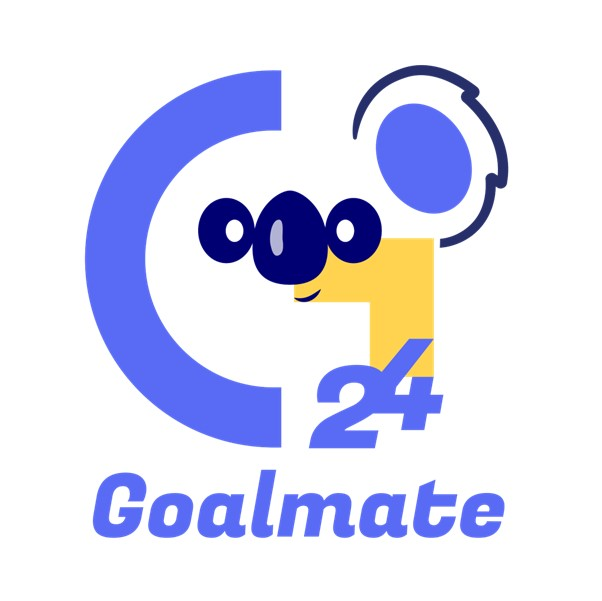
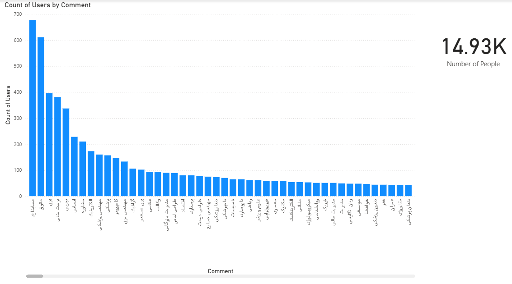
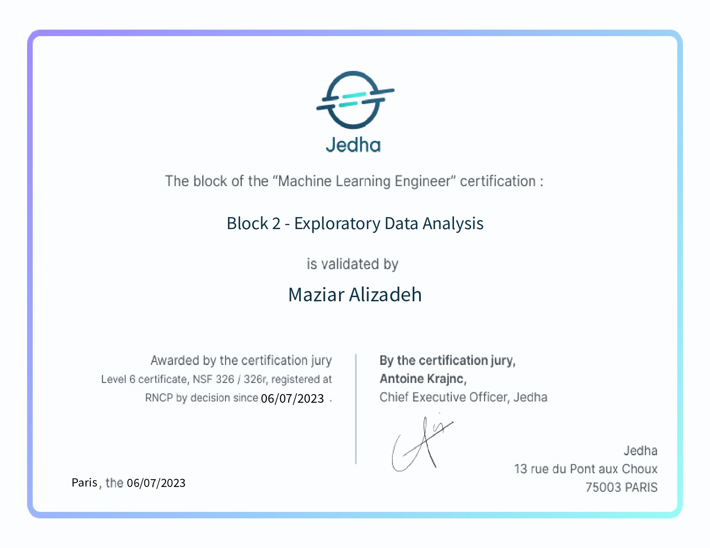
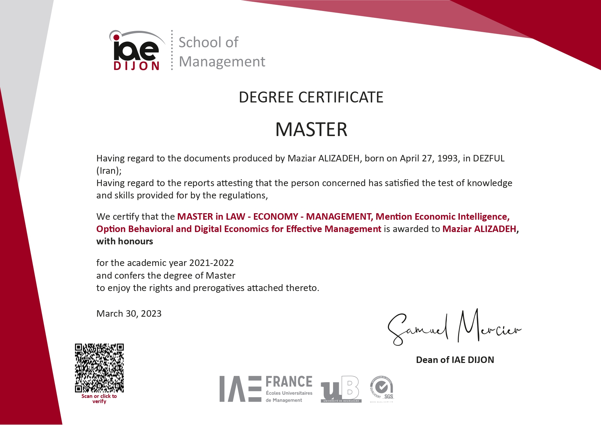

## About
I’m a business analyst and consultant with a passion for helping companies grow through a mix of strategic planning and data-driven insight. My experience spans startup strategy, market research, customer journey design, and sales optimization. I’ve worked with early-stage companies to design go-to-market plans, build clear value propositions, and identify untapped market opportunities. On the analytical side, I create predictive models, build dashboards, and extract insights from complex datasets to guide decision-making. I enjoy the challenge of connecting market realities with business strategy — turning data into clear actions that deliver results. My background in data analytics (trained in Paris) combined with hands-on work in business development allows me to bridge strategy and execution seamlessly.

## Expertise
- **Business Strategy** – Go-to-market planning, competitive analysis, business model design.

- **Data Analytics** – Power BI, Tableau, Python, SQL, predictive modeling.

- **Startup Growth** – Revenue optimization, ROI calculation, market segmentation.

- **Project Delivery** – Agile frameworks, strategic roadmapping, stakeholder engagement.

## Tools I Use
Power BI · Tableau · Python · SQL · Machine Learning (Logistic Regression, Random Forest) · Market Research Frameworks · Business Model Canvas

## Selected Experience
**Spark Bridge – Startup Business Consultant & Data Analyst (Remote, Canada)**

- Designed full business plans, pitch decks, and market entry strategies for startups.

- Analyzed competitors, defined target personas, and identified growth opportunities.

- Created revenue models and calculated ROI for early-stage businesses.

- Used customer journey mapping to guide acquisition and retention strategies.

**Pars Radin – Business Analyst (Tehran)**

- Built predictive models to forecast customer behavior and improve conversion rates.

- Integrated weather data with marketing analysis to uncover purchase patterns.

- Created Power BI dashboards to track sales performance and market trends.

**Rio Coffee – Strategic Planning Specialist (Tehran)**

- Researched market trends and customer behavior to inform operational strategies.

- Designed marketing initiatives to increase brand engagement and sales.

## Professional Projects
**Startup Business Planning & Market Analysis – Spark Bridge**

- Designed business plans, SWOTs, and financial models for startups entering new or resegmented markets. Defined target customers, segmented markets, and built entry strategies with risk mitigation in mind.

 

**Instagram Market Demand Analysis – Pars Radin**

- Analyzed thousands of Instagram comments to identify the most in-demand academic majors. Applied sentiment analysis to detect market trends in education.

 

**Predictive Analytics for Conversion Optimization – Pars Radin**

- Built Logistic Regression, Random Forest, and Decision Tree models to forecast customer behavior. Combined weather and sales data to create targeted marketing campaigns. Used SHAP to explain predictions and Power BI to visualize strategies.

**Customer Behavior Prediction & Market Basket Analysis – Cartridge World**
- Used R and statistical methods to uncover high-value product associations in customer purchases. Helped the business optimize sales and reduce risk by focusing on profitable product bundles.

 

## Education & Certifications

🎓 Master’s in Behavioral and Digital Economics – IAE Dijon, France

🎓 Bachelor’s in Computer Engineering – Azad University, Iran

📜 Data Analysis Essentials – Jedha, Paris

📜 Power BI – LinkedIn Learning

 
